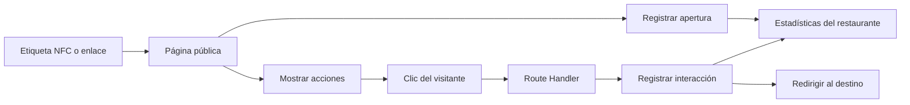

# Lennsi

**La experiencia de tu restaurante también es digital.**

Lennsi es una aplicación web SaaS para conectar los espacios físicos de un restaurante con su contenido digital mediante etiquetas NFC. Desde un panel, el establecimiento administra sucursales, mesas y otros puntos de contacto, configura los enlaces que verán sus clientes y consulta sus interacciones.

El cliente acerca su teléfono a una etiqueta y abre una página con el menú, Wi-Fi, WhatsApp, redes sociales o el enlace para dejar una reseña. Puede consultar el contenido desde el navegador, sin crear una cuenta en Lennsi.

**Estado:** MVP en desarrollo. Este repositorio reúne el sitio de presentación, el panel de administración, las páginas públicas y la integración con Supabase.

## El problema que resuelve

Un restaurante puede tener su menú, promociones, redes sociales y datos de contacto repartidos entre distintos canales. Actualizar esos destinos y conocer cuáles utilizan sus clientes se vuelve más difícil cuando existen varias sucursales o puntos de atención.

Lennsi centraliza esos recursos en una página configurable y vincula cada etiqueta con una ubicación del establecimiento. El enlace grabado en la etiqueta se mantiene mientras sus destinos se actualizan desde el panel: cambiar un menú o una red social no requiere volver a programar el NFC.

Por ejemplo, una etiqueta en **Mesa 04** puede abrir el menú de la sucursal correspondiente. Si el visitante pulsa **Dejar una reseña**, la aplicación registra el clic antes de redirigirlo a Google. El restaurante puede consultar la actividad por ubicación y acción.

## Recorrido del producto

1. **Crear una cuenta:** registro con correo y contraseña o acceso con Google.
2. **Configurar el restaurante:** onboarding, identidad del negocio y sucursal inicial.
3. **Organizar las ubicaciones:** sucursales y puntos de contacto como mesas, barras, terrazas o entradas.
4. **Preparar el contenido:** menú PDF, enlaces, Wi-Fi y acciones con orden y presentación configurables.
5. **Asociar una etiqueta:** generar su enlace público y grabarlo en un dispositivo NFC.
6. **Consultar resultados:** revisar accesos, clics y actividad desde el dashboard.

La aplicación gestiona las etiquetas y sus enlaces. La grabación física del NFC se realiza con una herramienta compatible, fuera del panel.

## Funciones implementadas

| Área | Qué incluye el código actual |
| --- | --- |
| Sitio público | Landing de producto, explicación del funcionamiento, precios y páginas legales. |
| Autenticación | Registro, inicio de sesión, confirmación de correo, acceso con Google y protección del dashboard. |
| Restaurantes | Onboarding y edición de información e identidad visual. |
| Sucursales | Gestión de datos de contacto, menú, Wi-Fi y enlaces del establecimiento. |
| Puntos de contacto | Creación y administración de ubicaciones físicas dentro de una sucursal. |
| Etiquetas NFC | Asociación con puntos de contacto, gestión de estado y enlaces públicos mediante tokens. |
| Editor de acciones | Configuración, orden y vista previa de los botones de la página pública. |
| Archivos | Integración con Supabase Storage para logotipos y menús. |
| Analítica | Indicadores, gráficas de actividad y rankings por acciones, sucursales y puntos de contacto; filtros por periodo y ubicación. |

Las métricas describen aperturas y clics registrados. **Un clic hacia reseñas de Google no confirma una reseña publicada**, y una apertura no equivale necesariamente a una persona distinta ni a una lectura física de NFC: el enlace también puede abrirse directamente.

## Stack tecnológico

| Tecnología | Uso en el proyecto |
| --- | --- |
| Next.js 16 · React 19 | App Router, renderizado en servidor, Server Actions y Route Handlers. |
| TypeScript | Tipado de componentes, formularios, respuestas y acceso a datos. |
| Supabase · PostgreSQL | Autenticación, persistencia, funciones SQL, políticas de acceso y almacenamiento. |
| Tailwind CSS 4 · shadcn/ui · Base UI | Estilos y componentes de interfaz. |
| React Hook Form · Zod | Formularios y validación de entradas y respuestas. |
| TanStack Query · TanStack Table | Consultas interactivas y tablas de administración. |
| Recharts | Visualización de estadísticas. |
| Motion | Animaciones y transiciones de la interfaz. |

Las versiones exactas y las dependencias están en [package.json](./package.json) y [package-lock.json](./package-lock.json).

## Arquitectura y decisiones técnicas

### Organización por funcionalidades

Las rutas se encuentran en `src/app`, mientras que cada dominio agrupa sus componentes, acciones, consultas, validaciones y tipos dentro de `src/features`. Esto permite seguir un flujo del producto sin concentrar toda la lógica en las páginas.

Se utilizan Server Components para las lecturas iniciales y componentes de cliente para formularios, filtros, tablas y otras interacciones. Las operaciones del servidor se implementan con las herramientas de Next.js, sin un servidor Express separado.

### Modelo para varios establecimientos

La relación entre usuarios y restaurantes se representa mediante membresías. Los roles pertenecen a esa relación, en lugar de ser una propiedad global del perfil del usuario.

```text
Usuario ── Membresía y rol ── Restaurante
                              └── Sucursal
                                  └── Punto de contacto
                                      └── Etiqueta NFC
```

El modelo contempla los roles `owner`, `admin`, `manager` y `viewer`. La interfaz de invitaciones y administración de miembros forma parte del trabajo pendiente. El onboarding actual restringe la creación cuando el usuario ya pertenece a un restaurante.

Las operaciones se apoyan en la sesión autenticada y en funciones y políticas de PostgreSQL. El repositorio incluye migraciones de evolución del esquema; su presencia no constituye una auditoría de la configuración de un despliegue concreto.

### Registro de interacciones en el servidor



El registro del clic se realiza antes de responder con la redirección. Así, el flujo no depende únicamente de un evento JavaScript que podría interrumpirse al abandonar la página.

Las funciones SQL resuelven el contexto de la etiqueta y la acción. La URL pública usa tokens en lugar de exponer directamente identificadores incrementales como enlaces de acceso.

### Onboarding y validación

El onboarding llama a una función PostgreSQL que crea el restaurante, la membresía del propietario y la sucursal inicial en una misma operación. Esta decisión evita dejar entidades parcialmente creadas si el proceso falla.

Zod valida entradas de formularios y determinadas respuestas de las funciones SQL, incluida la consulta de analítica. Los clientes Supabase de navegador y servidor están separados para atender sus distintos contextos de sesión.

## Dónde revisar el código

| Si quieres evaluar… | Punto de entrada |
| --- | --- |
| El diseño y la presentación del producto | [Hero de la landing](./src/features/landing/components/hero.tsx) |
| El flujo de autenticación | [Acciones de autenticación](./src/features/auth/actions/auth-actions.ts) |
| La creación inicial de un restaurante | [Endpoint de onboarding](./src/features/restaurants/api/create-restaurant-onboarding.ts) |
| La edición de contenido | [Módulo de acciones](./src/features/actions/components/actions-module.tsx) |
| La experiencia del visitante | [Página pública por token](./src/app/go/%5Btoken%5D/page.tsx) |
| El registro previo a una redirección | [Route Handler de acciones](./src/app/go/a/%5BtagToken%5D/%5BactionToken%5D/route.ts) |
| Las consultas y validación de métricas | [Consulta de analítica](./src/features/analytics/api/get-analytics.ts) |
| La evolución de la base de datos | [Migraciones SQL](./supabase/migrations) |

```text
src/
├── app/                  Rutas, páginas y endpoints
│   ├── (auth)/           Acceso y registro
│   ├── dashboard/        Panel del establecimiento
│   ├── go/               Páginas públicas y redirecciones
│   ├── api/              Route Handlers
│   └── legal/            Documentos legales en borrador
├── features/             Módulos organizados por dominio
├── components/           Componentes compartidos e interfaz base
├── lib/supabase/         Clientes y tipos de base de datos
└── proxy.ts              Sesiones y enrutamiento del subdominio público

supabase/migrations/      Evolución del esquema y funciones SQL
public/                  Recursos visuales
```

## Ejecutar en desarrollo

### Requisitos

- Node.js **20.9 o superior**, según el requisito de Next.js instalado, y npm.
- Un proyecto Supabase con el esquema, funciones, políticas y buckets que utiliza la aplicación.
- Configuración de Supabase Auth para los orígenes y redirecciones del entorno; proveedor Google configurado si se desea utilizar ese acceso.

**La base de datos requiere preparación previa.** Las migraciones incluidas modifican tablas y funciones existentes y no contienen todo el esquema inicial. No basta con aplicarlas a un proyecto Supabase vacío. Para reproducir el entorno completo se necesita una base compatible; el esquema y las políticas deben contrastarse con ese proyecto.

### Instalación

Desde la raíz del repositorio:

```bash
npm ci
```

Crea un archivo `.env.local` con los valores de tu entorno:

```dotenv
NEXT_PUBLIC_SUPABASE_URL=https://TU_PROYECTO.supabase.co
NEXT_PUBLIC_SUPABASE_PUBLISHABLE_KEY=TU_CLAVE_PUBLICABLE
NEXT_PUBLIC_PUBLIC_TAG_ORIGIN=http://go.localhost:3000
```

La variable de clave corresponde a la **clave publicable** de Supabase. Las variables `NEXT_PUBLIC_*` son accesibles desde el navegador; no deben contener una clave `service_role` ni otros secretos. Los archivos `.env*` están excluidos de Git.

Inicia el servidor:

```bash
npm run dev
```

Abre `http://localhost:3000` para ver el sitio y acceder al panel.

### Probar el recorrido público sin una etiqueta física

Con la base de datos preparada, crea una etiqueta desde el panel y abre su URL en el navegador. El origen local `http://go.localhost:3000` reproduce el flujo del subdominio público: el proxy transforma `/:token` en `/go/:token` y `/a/...` en `/go/a/...`.

Si tu entorno no resuelve `go.localhost`, configura ese nombre para que apunte a `127.0.0.1`. El teléfono y una etiqueta NFC solo son necesarios para comprobar la interacción física, no para recorrer las páginas y acciones desde el navegador.

### Comandos disponibles

| Comando | Propósito |
| --- | --- |
| `npm run dev` | Servidor de desarrollo. |
| `npm run build` | Compilación de producción. |
| `npm start` | Ejecutar una compilación de producción existente. |
| `npm run lint` | Revisión estática con ESLint. |
| `npx tsc --noEmit` | Comprobación de tipos TypeScript. |

El repositorio todavía no incluye una suite de pruebas automatizadas. Los comandos anteriores describen las comprobaciones disponibles, no un resultado de CI.

## Estado y próximos pasos

El núcleo del producto ya está representado en el código: administración del establecimiento, contenido público y medición de interacciones. Quedan por completar:

- Contratación en línea, suscripciones y facturación.
- Invitaciones y administración de miembros desde el panel.
- Historial ampliado, comparación de periodos, desglose por horario y exportación de reportes, anunciados como próximos en la página de precios.
- Preparación reproducible del esquema inicial de base de datos y pruebas automatizadas de los flujos principales.
- Datos definitivos de los documentos legales y verificación de los mecanismos de privacidad antes de su publicación final.

El alcance actual se centra en conectar contenido y medir su uso. Un sistema de pedidos, reservas o punto de venta queda fuera de este MVP.
